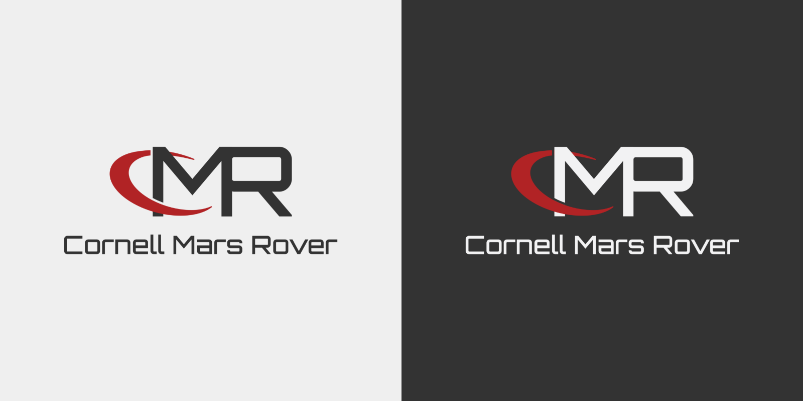
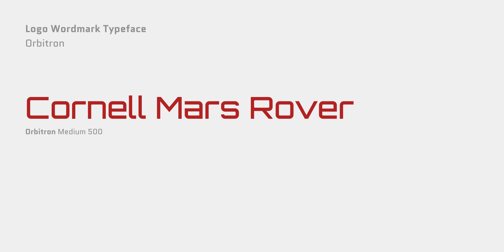
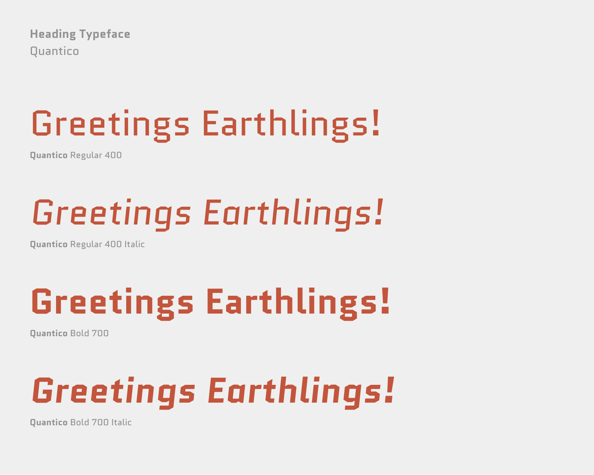
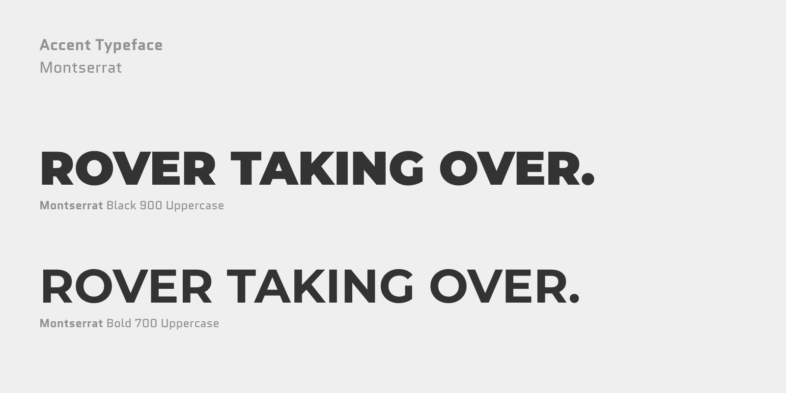
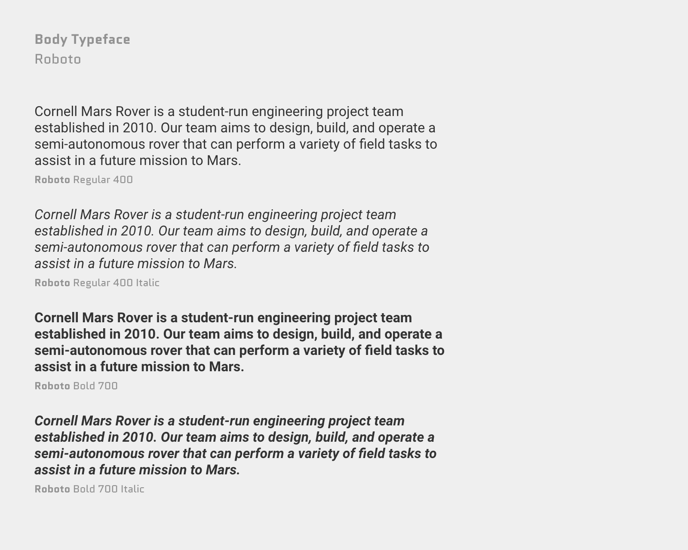
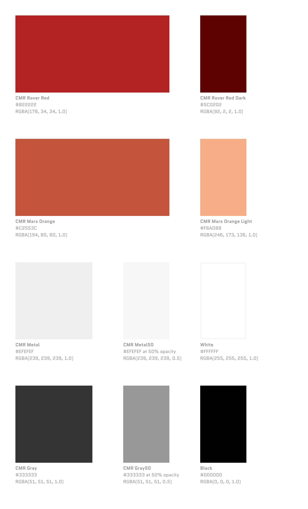
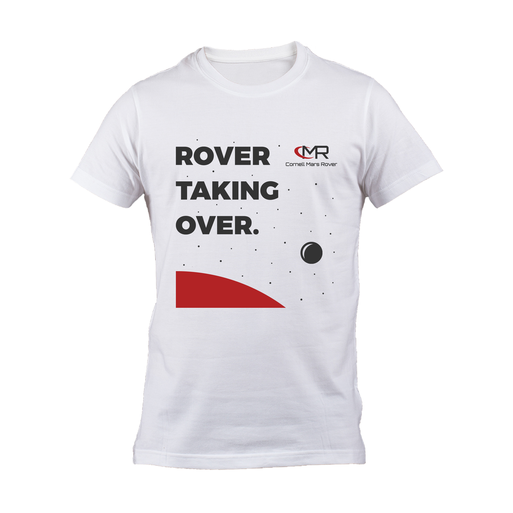
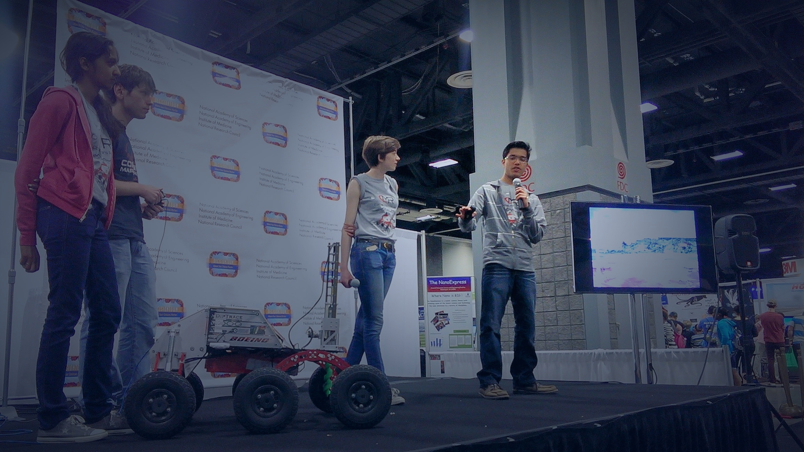
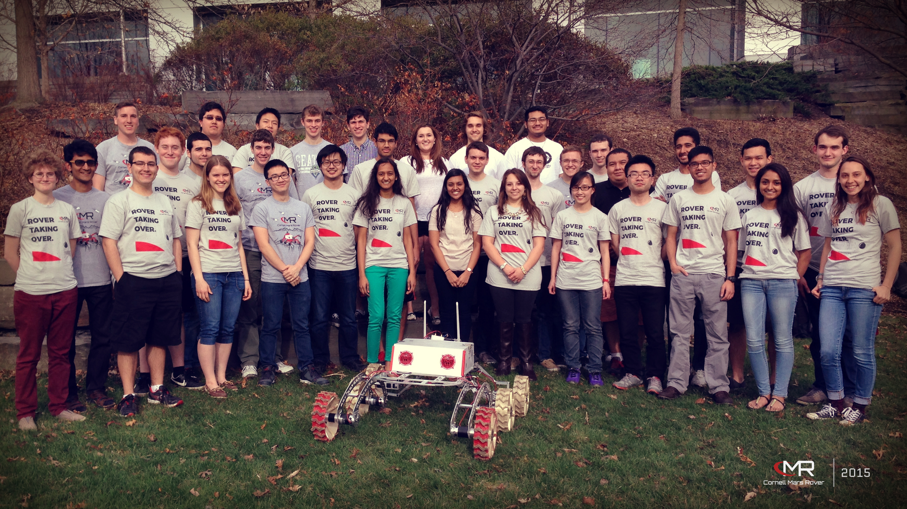

import { Text, Box, AspectRatio, Embed } from "theme-ui";
import pdfCmrRecruitmentDeck from "./cmr-recruitment-deck.pdf";

<Text as={Styled.h3} sx={{ fontWeight: "normal" }}>
  The Cornell Mars Rover team builds an innovative semi-autonomous rover to assist in a future mission to Mars.
</Text>

Cornell Mars Rover (CMR) was the first group I joined in college as a starry-eyed freshman.
Getting accepted into an engineering project team is a competitive endeavor at Cornell,
so I felt lucky to join 40+ other teammates passionate about the future of space exploration.

The team was founded in 2010, so as one of the newest teams on campus, 
there was plenty of work to do to make the team reach its potential.
Initially, I built up my technical chops by writing code for our rover's Controls Interface. 
But quickly, I realized if I leveraged my other talents, I could supercharge our underdog team 
by spearheading our marketing, fundraising, and growth. 
I pitched a vision, and the team let me chase it.

---

###### Team:

- **Arpit Sheth (Lead of Business Team)**
- **CMR Team Leads:** Georgia Crowther and John Draikiwicz
- _Total team of 40+ members; I recruited a team of 5 for the new Business Team_

###### Impact:

- Founded and recruited a new team to handle fundraising, marketing, and operations
- Boosted sponsorship by 66% and oversaw a $40,000 budget for a team of 40 members
- Spearheaded new branding strategy during my first-year resulting in doubled recruitment applications the following cycle
- Managed $10,000 goal crowdfunding campaign, which raised $17,000 

###### Awards:

- Achieved 1st Place at the University Rover Competition for technical communication with video
- Selected by the National Academies of Sciences to speak at the USA Science & Engineering Festival

---

# Artifacts 🏺

## Vision 🛸

When I joined Cornell Mars Rover, the team was only about three years old.
As a young team with an ambitious mission, CMR had great innovative potential,
but it lacked the name recognition of renowned teams with 20+ years of presence on campus.
My goal was to bring the team's vision and culture to life
in order to make the team more attractive to prospective students and sponsors.

As a freshman, I began working directly with the CMR Team Lead, Georgia Crowther,
to learn the history of the team and better define its cultural values moving forward.
This work culminated in the **CMR Brand Identity Guide**, website, and promotional materials
which I revealed in my first year. In subsequent years, I leveraged this foundation to make CMR one of the most
reputable, competitive, and fun teams to join. 

In a few short years, CMR went from an unknown team to consistently beating out
more established teams for top engineering talent.

### Recruitment Deck

As the Business Team Lead, I took charge of our annual recruitment process.
Under my management, I doubled the number of applications in only one year.
CMR was in the big-leagues now and 
became as competitive to join as teams that had been around for 20+ years. 
My approach to recruitment succeeded because I
promoted a culture of **diversity, excellence, and playfulness.**

<a href={pdfCmrRecruitmentDeck}>CMR Recruitment Deck (.pdf)</a>

<Box sx={{ display: ['none', null, null, null, 'initial'] }}>
  <AspectRatio ratio={5/3}>
    <iframe src={pdfCmrRecruitmentDeck} width="100%" height="100%" />
  </AspectRatio>
</Box>

To relax our audience and have some fun before our session began, I set up a looping backdrop with 
[space puns](https://www.youtube.com/watch?v=vMaLxs6TUm0). It was a big hit!
To some people's dread, puns became an enduring element of our team culture...

### Brand Identity

The recruitment, marketing, and fundraising successes of the team rested upon the foundation 
of our newly minted brand identity, which I crafted in my first year on the team.
I researched the founding history of Cornell Mars Rover and drew inspiration from NASA’s previous Mars misions.
Below are highlights from the CMR Brand Identity Guide that capture the vision of the team.

## Culture 👽

I believe mission-driven teams are high-performing teams.
Simply encoding a team's mission and values in a brand guide is not enough.
That's why I made to sure to lead by example and promote our team's cultural values internally and externally.

Over time, Cornell Mars Rover's unique team culture helped us attract the brightest engineers and builders on campus.
The caliber of talent on our team enabled us to win competitions and lock down big sponsorships,
which has kept the team at the forefront of opportunities.
Most importantly, I am proud that our culture has fostered enduring relationships well beyond school.

### Inspire “Sci-Fi” to “Sci-Fact”

I was invited to speak on behalf of the National Academies of Sciences and the Mars Society
at the [USA Science & Engineering Festival](https://usasciencefestival.org/), 
the largest STEM convention in the nation, about our work on Cornell Mars Rover.
It was an honor showing off our rover and inspiring young minds about the the future of space exploration.
It isn't a fantasy&mdash;it's a fact&mdash;and they can pursue it.

We could tell we were making a difference in the lives of children who ran over to us to learn more.
The the sheer excitement and curiosity they expressed was unforgettable.
Even with adults, the conversations we had enlightened us and raised our own ambitious standards. 
It was incredible!

### Diversity, Mentorship, and Imagination

I attribute my success on Cornell Mars Rover to the fact that I adopted an entrepreneurial mindset.
Even though I initially joined the team to develop robotics software, I quickly found opportunities
to innovate, grow, and disrupt beyond the structure of my role. I took initiative to paint my vision,
and got buy-in from the team to craft a new role to better fit my strengths.

As I became more senior on the team, I became an ardent advocate for diversity and mentorship on the team.
I wanted to inspire a team culture where everyone felt empowered to contribute
in unconventional and imaginative ways, just as I had done.

The Business Team I founded and recruited became a mainstay on the team,
and its scope and influence has continued to expand over the years.
These days, I am grateful to cheer on the team from the sidelines as an alumni mentor.
Rover taking over!

# Endorsements 📣

> “Arpit and I worked together as a part of the Cornell Mars Rover (CMR) project team for 3 years. 
> During this time Arpit helped transform the team’s branding, making CMR one of the most recognizable project teams on campus in that span. 
> During his freshman year he took the initiative and redesigned the team’s website and started working closely with the team’s business subteam, 
> despite originally being on a completely different subteam. 
>
> As a result of these efforts he became the business subteam lead his sophomore year and reimagined our recruitment and marketing material 
> to give CMR a brand new and improved feel. This resulted in CMR’s applications more than doubling and its acceptance rate falling to below 15%. 
> Arpit is an extremely talented presenter who has a strong intuition for design and an entrepreneurial mindset that would benefit any team.”
>
> _**&ndash; John Draikiwicz**, CMR Team Lead_ 

---

_Website: [Cornell Mars Rover](https://marsrover.engineering.cornell.edu/)_