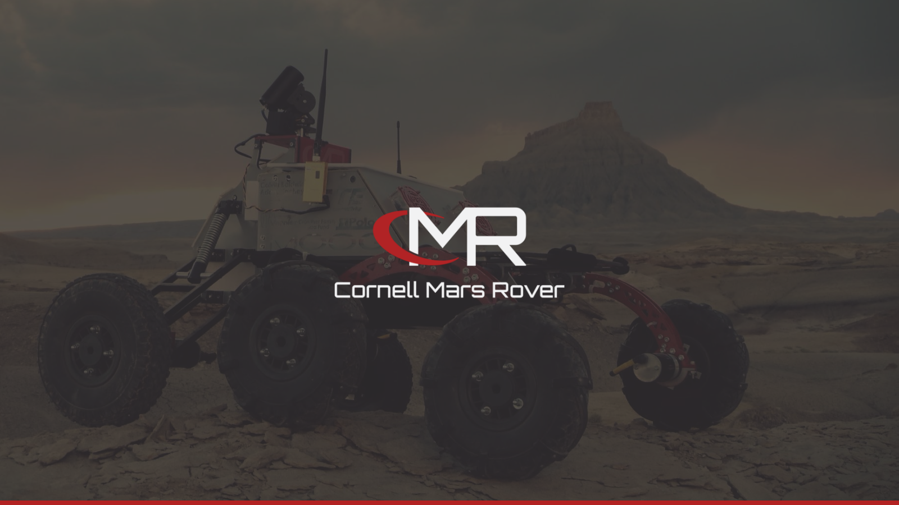

import { Text } from "theme-ui";

<Text as={Styled.h3} sx={{ fontWeight: "normal" }}>
  The Cornell Mars Rover team builds an innovative semi-autonomous rover to assist in a future mission to Mars.
</Text>

Cornell Mars Rover was the first group I joined in college as a starry-eyed freshman.
Getting accepted into an engineering project team is a competitive endeavor at Cornell,
so I felt lucky to join 40+ other teammates passionate about the future of space exploration.

The team was founded in 2010, so as one of the newest teams on campus, 
there was plenty of work to do to make the team reach its potential.
Initially, I built up my technical chops by writing code for our rover's Controls Interface. 
But quickly, I realized if leveraged my other talents, I could supercharge our underdog team 
by spearheading our marketing, fundraising, and growth. 
I pitched a vision, and the team let me chase it.

---

###### Team:

- **Arpit Sheth (Lead of Business Team)**
- **CMR Team Leads:** Georgia Crowther and John Draikiwicz
- _Total team of 40+ members; I recruited a team of 5 for the new Business Team_

###### Impact:

- Founded and recruited a new team to handle fundraising, marketing, and operations
- Boosted sponsorship by 66% and oversaw a $40,000 budget for a team of 40 members
- Spearheaded new branding strategy during my first-year resulting in doubled recruitment applications the following cycle
- Managed $10,000 goal crowdfunding campaign, which raised $17,000 

###### Awards:

- Achieved 1st Place at the University Rover Competition for technical communication with video
- Selected by the Mars Society and National Academy of Sciences to speak at the USA Science & Engineering Festival

---

# Artifacts 🏺

## Vision 🛸

### Recruitment Deck

### Brand Identity

## Culture 👽

### Inspire “Sci-Fi” to “Sci-Fact”

### Diversity, Mentorship, and Imagination

# Endorsements 📣

---

_Website: [Cornell Mars Rover](marsrover.engineering.cornell.edu/)_